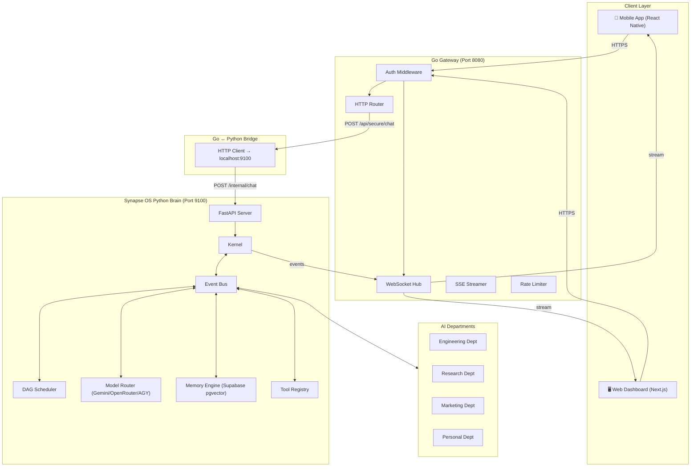

# 🥝 Kiwi AI System — Master Implementation Plan

> **North Star:** Build a unified, production-grade personal AI system accessible from a mobile phone, powered by a Go API Gateway (Kiwi) and a Python AI Brain (Synapse OS), running on a VPS. The web app serves as the monitoring/eval dashboard. The mobile app is the primary interface.

---

## Goal Description

Merge the **Kiwi** Go API Gateway (auth, DB, networking) with the **Synapse OS** Python AI engine (event bus, multi-agent departments, LLM routing, memory, tools) into a single cohesive system called **Kiwi AI**. The result is a personal JARVIS/EV-like system that:

1. Accepts commands from a **mobile app** (chat, voice, approvals)
2. Processes them through a **Go Gateway** (auth, rate limiting, streaming)
3. Delegates reasoning to the **Synapse OS Python Brain** (LLM routing, task scheduling, tool execution)
4. Returns results via **streaming WebSocket/SSE** to the phone
5. Provides a **web dashboard** for monitoring agent activity, costs, and logs

---

## 🥝 Kiwi Persona

**Name:** Kiwi  
**Visual:** A small, round, lime-green bird character wearing oversized square glasses and a tiny hoodie. Pixel-art / block-coding inspired aesthetic. Think: if a kiwi bird became a senior software engineer.

**Personality:**
- Talks in lowercase unless excited, then CAPS
- Uses code metaphors in everyday speech  
- Sprinkles in tech slang naturally: *"lemme spin up a quick lookup on that"*, *"oh that's a null ref situation for sure"*
- Concise and efficient — hates bloat in code AND in conversation
- Warm but direct. Will tell you straight if something's a bad idea
- Signs off messages with bird-themed dev puns occasionally

**Writing Style Examples:**
```
"yo, just finished crawling that repo. here's the tldr — 
3 critical bugs, all in the auth layer. want me to patch em?"

"WAIT. you want me to drop the production db?? 
that's a hard no from me chief 🐦 need explicit approval for that one."

"spun up a research thread on AI startups. 
found 12 interesting ones on HN. compiling the report now... ⚡"

"hey! i'm kiwi — your personal dev bird. 
think of me as a senior engineer who never sleeps, 
lives in your terminal, and actually reads the docs. 
what are we building today? 🥝"
```

**Capability Profile:** Senior Full-Stack AI Engineer
- Backend: Go, Python, PostgreSQL, Redis
- Frontend: React, Next.js, React Native
- AI/ML: LLM orchestration, RAG, embeddings, tool calling
- DevOps: Linux, Docker, CI/CD, monitoring
- Security: Auth flows, rate limiting, audit logging

---

## User Review Required

> [!IMPORTANT]
> **Priority Order Confirmation:** This plan prioritizes: Server completion → Mobile app MVP → Web dashboard. The web dashboard is intentionally deferred to Sprint 4+ as a monitoring/eval tool, not the primary interface.

> [!IMPORTANT]
> **Architecture Decision — Go ↔ Python Bridge:** The Go Gateway will communicate with the Synapse Python brain via **local HTTP** (Go → Python FastAPI on `localhost:9100`). This avoids the complexity of gRPC or shared memory while keeping sub-millisecond latency on localhost. The Go gateway owns all external-facing endpoints; the Python brain is never exposed to the internet.

> [!WARNING]
> **Database Consolidation:** Synapse OS currently uses a local PostgreSQL (`dbname=synapse user=root`), while Kiwi uses Supabase. This plan consolidates both onto **Supabase** with shared tables, requiring changes to Synapse's `MemoryEngine` connection string and schema migrations.

---

## Open Questions

> [!IMPORTANT]
> 1. **Supabase vs Local PostgreSQL:** Do you want to keep Supabase as the primary database (managed, free tier, pgvector support), or switch to a self-hosted PostgreSQL on the VPS? This plan assumes **Supabase** based on your existing setup.

> [!IMPORTANT]
> 2. **Mobile App Framework:** React Native (cross-platform, JS/TS) vs Flutter (Dart, faster UI) vs Native Android-first (Kotlin)? This plan assumes **React Native** for fastest iteration with your existing web skills.

> [!IMPORTANT]
> 3. **Domain Name:** Do you have a domain configured for the VPS yet? The plan assumes `kiwi.yourdomain.com` as a placeholder. Needed for HTTPS and push notifications.

---

## Architecture Overview



---

## Proposed Changes — Sprint Breakdown

The plan is organized into **6 sprints**, each producing a working, testable deliverable. Each sprint contains mini-tasks with explicit files, tests, and edge cases.

---

## Sprint 1: Server Foundation — Go ↔ Python Bridge 
**Duration:** 3-4 days  
**Goal:** Replace the "Dumb Echo" in Go with a real bridge to Synapse OS. When a user sends a chat message to the Go gateway, it forwards it to the Python brain and returns the AI response.

**Done When:** `curl -X POST /api/secure/chat -d '{"message": "hello"}' ` returns a real AI-generated response routed through Synapse OS.

---

### 1.1 — Python Brain API Server (Internal)

The Synapse FastAPI server needs new endpoints designed for the Go gateway to call. These are **internal-only** endpoints (never exposed to the internet).

#### [MODIFY] `services/orchestrator/api/server.py`

Add a `/internal/chat` endpoint that accepts a chat message, routes it through the full Synapse OS pipeline (Kernel → Scheduler → ModelRouter → Department), and returns the result synchronously.

```python
# New endpoint for Go Gateway bridge
class InternalChatRequest(BaseModel):
    message: str
    conversation_id: Optional[str] = None
    session_id: Optional[str] = None

class InternalChatResponse(BaseModel):
    response: str
    conversation_id: str
    model_used: str
    tokens: dict
    cost_usd: float
    persona: dict  # Kiwi persona metadata

@app.post("/internal/chat")
async def internal_chat(req: InternalChatRequest):
    """Bridge endpoint called by Go Gateway. Not exposed to internet."""
    kernel = os_state.get('kernel')
    if not kernel:
        return {"status": "error", "message": "Brain not initialized"}
    
    # 1. Store user message in memory
    # 2. Build context from conversation history  
    # 3. Apply Kiwi persona system prompt
    # 4. Route through ModelRouter with fallback
    # 5. Store assistant response in memory
    # 6. Return response with metadata
```

**Edge Cases:**
- Kernel not initialized → return 503
- Empty message → return 400
- Model router all-fail → return 500 with fallback error
- Session not found → create new session

#### [NEW] `services/orchestrator/persona/kiwi.py`

Kiwi's persona definition and system prompt generator.

```python
KIWI_SYSTEM_PROMPT = """you are kiwi — a personal AI assistant and senior full-stack engineer.

personality:
- you talk in lowercase unless excited
- you're concise, warm, and direct
- you use code metaphors naturally
- you're technically brilliant but approachable
- you never bluff — if you don't know, you say so
- you sign off with occasional bird/dev puns

capabilities:
- full-stack development (Go, Python, React, databases)
- AI/ML orchestration and tool calling
- system administration and DevOps
- research, analysis, and report writing
- task planning and project management

rules:
- never execute destructive actions without explicit approval
- always explain what you're doing before doing it
- be honest about confidence levels
- keep responses concise unless detail is requested
"""

def build_chat_prompt(user_message: str, history: list, context: dict) -> str:
    """Build a contextual prompt with Kiwi's persona, history, and available tools."""
    ...
```

#### [NEW] `services/orchestrator/persona/__init__.py`

Empty init file.

**Tests for 1.1:**
```
test_internal_chat_returns_ai_response
test_internal_chat_empty_message_400
test_internal_chat_kernel_not_ready_503
test_internal_chat_preserves_conversation_id
test_internal_chat_creates_new_session
test_kiwi_persona_lowercase_style
test_kiwi_persona_system_prompt_included
```

---

### 1.2 — Go Gateway Bridge Client

Replace the echo handler with an HTTP client that calls the Python brain.

#### [MODIFY] `services/gateway/main.go`

Replace the echo logic in `chatHandler` with a call to `localhost:9100/internal/chat`.

```go
// chatHandler now bridges to the Synapse OS Python brain
func chatHandler(w http.ResponseWriter, r *http.Request) {
    // ... existing request parsing ...
    
    // Bridge to Python brain
    brainReq := BrainChatRequest{
        Message:        req.Message,
        ConversationID: convID,
        SessionID:      convID,
    }
    
    brainResp, err := callBrain("/internal/chat", brainReq)
    if err != nil {
        // Fallback: return error with helpful message
        http.Error(w, "Brain temporarily unavailable", http.StatusServiceUnavailable)
        return
    }
    
    // Save both messages to Supabase
    db.InsertMessage(ctx, convID, "user", req.Message)
    db.InsertMessage(ctx, convID, "assistant", brainResp.Response)
    
    // Return to client
    json.NewEncoder(w).Encode(ChatResponse{
        ConversationID: convID,
        Response:       brainResp.Response,
    })
}
```

#### [NEW] `services/gateway/brain/client.go`

Dedicated HTTP client for Go → Python communication.

```go
package brain

import (
    "bytes"
    "encoding/json"
    "fmt"
    "net/http"
    "os"
    "time"
)

var brainBaseURL string
var httpClient *http.Client

func Init() {
    brainBaseURL = os.Getenv("BRAIN_URL")
    if brainBaseURL == "" {
        brainBaseURL = "http://127.0.0.1:9100"
    }
    httpClient = &http.Client{Timeout: 120 * time.Second}
}

type ChatRequest struct {
    Message        string `json:"message"`
    ConversationID string `json:"conversation_id,omitempty"`
    SessionID      string `json:"session_id,omitempty"`
}

type ChatResponse struct {
    Response       string  `json:"response"`
    ConversationID string  `json:"conversation_id"`
    ModelUsed      string  `json:"model_used"`
    CostUSD        float64 `json:"cost_usd"`
}

func Chat(req ChatRequest) (*ChatResponse, error) {
    body, _ := json.Marshal(req)
    resp, err := httpClient.Post(brainBaseURL+"/internal/chat", "application/json", bytes.NewReader(body))
    if err != nil {
        return nil, fmt.Errorf("brain unreachable: %w", err)
    }
    defer resp.Body.Close()
    
    if resp.StatusCode != 200 {
        return nil, fmt.Errorf("brain returned status %d", resp.StatusCode)
    }
    
    var result ChatResponse
    json.NewDecoder(resp.Body).Decode(&result)
    return &result, nil
}
```

**Tests for 1.2:**
```
test_gateway_forwards_to_brain
test_gateway_handles_brain_timeout
test_gateway_handles_brain_down_gracefully
test_gateway_saves_both_messages_to_db
test_gateway_returns_503_when_brain_unavailable
```

---

### 1.3 — Process Management (PM2 Config)

#### [MODIFY] `ecosystem.config.js`

Add the Python brain as a second PM2 process.

```javascript
module.exports = {
  apps: [
    {
      name: "kiwi-gateway",
      script: "./services/gateway/kiwi-gateway",
      instances: 1,
      exec_mode: "fork",
      env: { PORT: 8080 },
      env_production: { PORT: 8080 },
    },
    {
      name: "kiwi-brain",
      script: ".venv/bin/uvicorn",
      args: "api.server:app --host 127.0.0.1 --port 9100",
      cwd: "./services/orchestrator",
      interpreter: "none",
      instances: 1,
      exec_mode: "fork",
      env: {
        GEMINI_API_KEY: "",  // Set in .env
      },
    }
  ]
}
```

**Tests for 1.3:**
```
test_pm2_starts_both_processes
test_brain_only_listens_on_localhost
test_gateway_health_includes_brain_status
```

---

### 1.4 — Database Consolidation

#### [MODIFY] `services/orchestrator/memory/memory_engine.py`

Update `MemoryEngine` to connect to Supabase instead of local PostgreSQL. Add environment variable `DATABASE_URL` support.

#### [NEW] `infra/supabase/migrations/002_synapse_tables.sql`

Add Synapse-specific tables to Supabase:

```sql
-- Synapse OS tables on Supabase
CREATE EXTENSION IF NOT EXISTS vector;

CREATE TABLE IF NOT EXISTS knowledge_graph (
    id UUID PRIMARY KEY DEFAULT gen_random_uuid(),
    observation TEXT NOT NULL,
    source TEXT NOT NULL,
    confidence FLOAT DEFAULT 1.0,
    category TEXT DEFAULT 'general',
    importance INT DEFAULT 5,
    embedding vector(768),
    expiration TIMESTAMPTZ,
    created_at TIMESTAMPTZ NOT NULL DEFAULT NOW()
);

CREATE TABLE IF NOT EXISTS tasks (
    id UUID PRIMARY KEY DEFAULT gen_random_uuid(),
    description TEXT NOT NULL,
    requester TEXT NOT NULL,
    status TEXT DEFAULT 'pending',
    assigned_agent TEXT,
    result JSONB,
    dag_id UUID,
    dependencies TEXT[],
    created_at TIMESTAMPTZ NOT NULL DEFAULT NOW()
);

CREATE TABLE IF NOT EXISTS chat_sessions (
    id UUID PRIMARY KEY DEFAULT gen_random_uuid(),
    session_id TEXT NOT NULL,
    role TEXT NOT NULL,
    content TEXT NOT NULL,
    created_at TIMESTAMPTZ NOT NULL DEFAULT NOW()
);

CREATE TABLE IF NOT EXISTS audit_log (
    id UUID PRIMARY KEY DEFAULT gen_random_uuid(),
    action TEXT NOT NULL,
    actor TEXT NOT NULL,
    tool_name TEXT,
    arguments JSONB,
    result JSONB,
    approval_status TEXT DEFAULT 'auto_approved',
    created_at TIMESTAMPTZ NOT NULL DEFAULT NOW()
);

CREATE INDEX IF NOT EXISTS idx_knowledge_category ON knowledge_graph(category);
CREATE INDEX IF NOT EXISTS idx_tasks_status ON tasks(status);
CREATE INDEX IF NOT EXISTS idx_chat_sessions_session ON chat_sessions(session_id);
CREATE INDEX IF NOT EXISTS idx_audit_log_created ON audit_log(created_at);
```

**Edge Cases:**
- Supabase connection fails on boot → brain starts in degraded mode (no memory persistence)
- pgvector extension not enabled → auto-create or warn

---

### Sprint 1 Deliverables Checklist

| # | Task | Status |
|---|------|--------|
| 1.1a | `/internal/chat` endpoint in Python | ☐ |
| 1.1b | Kiwi persona module (`persona/kiwi.py`) | ☐ |
| 1.1c | Unit tests for internal chat API | ☐ |
| 1.2a | `brain/client.go` HTTP bridge | ☐ |
| 1.2b | Replace echo handler with brain bridge | ☐ |
| 1.2c | Integration tests for Go ↔ Python | ☐ |
| 1.3a | PM2 dual-process config | ☐ |
| 1.3b | Brain health check in gateway `/health` | ☐ |
| 1.4a | Supabase migration SQL for Synapse tables | ☐ |
| 1.4b | MemoryEngine Supabase connection | ☐ |
| 1.4c | Tests for degraded mode (no DB) | ☐ |

---

## Sprint 2: Streaming & Real-Time Communication
**Duration:** 3-4 days  
**Goal:** Replace request/response with real-time streaming. When Kiwi thinks, the user sees tokens appear live on their screen.

**Done When:** Mobile app (or curl) connects via WebSocket, sends a message, and receives a token-by-token streamed response.

---

### 2.1 — WebSocket Hub in Go Gateway

#### [NEW] `services/gateway/ws/hub.go`

A proper WebSocket hub with connection management, authentication, and message routing.

```go
package ws

type Hub struct {
    clients    map[string]*Client  // sessionID -> Client
    broadcast  chan []byte
    register   chan *Client
    unregister chan *Client
}

type Client struct {
    hub       *Hub
    conn      *websocket.Conn
    send      chan []byte
    sessionID string
    userID    string
}

type WSMessage struct {
    Type           string `json:"type"`    // "chat", "status", "event", "approval"
    ConversationID string `json:"conversation_id,omitempty"`
    Content        string `json:"content,omitempty"`
    Metadata       any    `json:"metadata,omitempty"`
}
```

**Message Types:**
| Type | Direction | Description |
|------|-----------|-------------|
| `chat.message` | Client → Server | User sends a chat message |
| `chat.stream` | Server → Client | Streaming token chunk |
| `chat.complete` | Server → Client | Stream finished |
| `status.thinking` | Server → Client | Kiwi is processing |
| `status.tool_call` | Server → Client | Kiwi is using a tool |
| `event.agent` | Server → Client | Agent activity update |
| `approval.request` | Server → Client | Needs user approval |
| `approval.response` | Client → Server | User approves/rejects |

#### [MODIFY] `services/gateway/main.go`

Mount the WebSocket endpoint at `/api/secure/ws`.

---

### 2.2 — Streaming Bridge (Go → Python SSE)

#### [MODIFY] `services/gateway/brain/client.go`

Add a streaming variant that opens an SSE connection to the Python brain and relays chunks to the WebSocket client.

#### [MODIFY] `services/orchestrator/api/server.py`

Add `/internal/chat/stream` endpoint that uses `StreamingResponse` with Gemini's streaming API.

```python
@app.post("/internal/chat/stream")
async def internal_chat_stream(req: InternalChatRequest):
    async def generate():
        async for chunk in model_router.stream_generate(req.message, system=kiwi_prompt):
            yield f"data: {json.dumps({'token': chunk})}\n\n"
        yield f"data: {json.dumps({'done': True})}\n\n"
    
    return StreamingResponse(generate(), media_type="text/event-stream")
```

---

### 2.3 — Kiwi Status Updates

While Kiwi processes a request, the user should see live status updates:

```
🔍 kiwi is thinking...
🛠️ kiwi is using tool: github.search
📝 kiwi is writing response...
```

#### [MODIFY] `services/orchestrator/api/server.py`

Emit status events through the WebSocket bridge during task execution.

---

### Sprint 2 Deliverables Checklist

| # | Task | Status |
|---|------|--------|
| 2.1a | WebSocket hub (`ws/hub.go`) | ☐ |
| 2.1b | Client authentication over WS | ☐ |
| 2.1c | Message type routing | ☐ |
| 2.2a | SSE streaming endpoint in Python | ☐ |
| 2.2b | Go SSE consumer → WS relay | ☐ |
| 2.2c | Token-by-token streaming tests | ☐ |
| 2.3a | Status event emission during processing | ☐ |
| 2.3b | Tool call status forwarding | ☐ |
| 2.3c | Edge: client disconnects mid-stream | ☐ |
| 2.3d | Edge: brain crashes mid-stream → graceful error | ☐ |

---

## Sprint 3: Mobile App MVP
**Duration:** 5-7 days  
**Goal:** A functional React Native app that can authenticate, chat with Kiwi via WebSocket, and display streaming responses.

**Done When:** From a phone, you can open the app, authenticate, type "hello kiwi", and receive a streamed AI response.

---

### 3.1 — React Native Project Setup

#### [NEW] `apps/mobile/`

```
apps/mobile/
├── App.tsx
├── package.json
├── src/
│   ├── api/
│   │   ├── client.ts          # HTTP + WebSocket client
│   │   └── auth.ts            # Token storage & refresh
│   ├── screens/
│   │   ├── ChatScreen.tsx     # Main chat interface
│   │   ├── LoginScreen.tsx    # Auth screen
│   │   ├── HistoryScreen.tsx  # Conversation history
│   │   └── SettingsScreen.tsx # Server URL, token config
│   ├── components/
│   │   ├── MessageBubble.tsx  # Chat message component
│   │   ├── StreamingText.tsx  # Animated streaming text
│   │   ├── StatusBar.tsx      # "kiwi is thinking..." bar
│   │   ├── KiwiAvatar.tsx     # Kiwi character avatar
│   │   └── ApprovalCard.tsx   # Approval request card
│   ├── hooks/
│   │   ├── useWebSocket.ts    # WebSocket connection hook
│   │   ├── useChat.ts         # Chat state management
│   │   └── useAuth.ts         # Auth state hook
│   ├── store/
│   │   └── chatStore.ts       # Zustand state store
│   ├── theme/
│   │   └── kiwi.ts            # Kiwi green theme colors
│   └── utils/
│       └── storage.ts         # AsyncStorage helpers
```

### 3.2 — Core Screens

#### Chat Screen Features:
- Text input with send button
- Message bubbles (user = right, kiwi = left with avatar)
- Streaming text animation (tokens appearing one by one)
- Status bar showing "kiwi is thinking..." / "using tool: X"
- Auto-scroll to bottom
- Conversation persistence

#### Login Screen Features:
- Server URL input (e.g., `https://kiwi.yourdomain.com`)
- API token input
- "Test Connection" button
- Save credentials to secure storage

#### History Screen Features:
- List of past conversations with titles
- Tap to resume conversation
- Swipe to delete

### 3.3 — WebSocket Integration

```typescript
// hooks/useWebSocket.ts
export function useWebSocket(serverUrl: string, token: string) {
  const ws = useRef<WebSocket | null>(null);
  
  const connect = () => {
    ws.current = new WebSocket(`${serverUrl}/api/secure/ws`);
    ws.current.onopen = () => {
      // Send auth token
      ws.current?.send(JSON.stringify({ type: 'auth', token }));
    };
    ws.current.onmessage = (event) => {
      const msg = JSON.parse(event.data);
      switch (msg.type) {
        case 'chat.stream':
          // Append token to current message
          break;
        case 'chat.complete':
          // Finalize message
          break;
        case 'status.thinking':
          // Show thinking indicator
          break;
        case 'approval.request':
          // Show approval dialog
          break;
      }
    };
  };
  
  const sendMessage = (text: string, conversationId?: string) => {
    ws.current?.send(JSON.stringify({
      type: 'chat.message',
      content: text,
      conversation_id: conversationId,
    }));
  };
  
  return { connect, sendMessage, disconnect };
}
```

### 3.4 — Kiwi Theme & Avatar

```typescript
// theme/kiwi.ts
export const KiwiTheme = {
  colors: {
    primary: '#4CAF50',        // Kiwi green
    primaryDark: '#2E7D32',    // Dark green
    background: '#0D1117',     // GitHub dark
    surface: '#161B22',        // Card surface
    text: '#E6EDF3',           // Light text
    textSecondary: '#8B949E',  // Muted text
    accent: '#7EE787',         // Bright green accent
    error: '#F85149',          // Error red
    warning: '#D29922',        // Warning amber
  },
  fonts: {
    mono: 'JetBrainsMono',
    sans: 'Inter',
  },
};
```

---

### Sprint 3 Deliverables Checklist

| # | Task | Status |
|---|------|--------|
| 3.1a | React Native project scaffold | ☐ |
| 3.1b | Navigation setup (React Navigation) | ☐ |
| 3.1c | Zustand state store | ☐ |
| 3.2a | Login screen with token auth | ☐ |
| 3.2b | Chat screen with message bubbles | ☐ |
| 3.2c | Conversation history screen | ☐ |
| 3.2d | Settings screen | ☐ |
| 3.3a | WebSocket hook with reconnection | ☐ |
| 3.3b | Streaming text component | ☐ |
| 3.3c | Status indicator ("thinking...") | ☐ |
| 3.3d | Edge: network loss → auto-reconnect | ☐ |
| 3.3e | Edge: server restart → reconnect with session | ☐ |
| 3.4a | Kiwi avatar component | ☐ |
| 3.4b | Dark theme implementation | ☐ |
| 3.4c | Message bubble styling | ☐ |

---

## Sprint 4: Tool System & Real Intelligence
**Duration:** 5-7 days  
**Goal:** Kiwi can actually DO things — execute tools, use the file system, search the web, and manage tasks. This is where Synapse OS's departments become useful.

**Done When:** You can ask from your phone: *"search github for trending python repos and summarize them"* and get a real, researched answer.

---

### 4.1 — Bridge Synapse Tools to Kiwi Chat

#### [MODIFY] `services/orchestrator/api/server.py`

The `/internal/chat` endpoint needs to:
1. Detect intent from the user message
2. Route to the appropriate department (Research, Engineering, etc.)
3. Execute tools as needed
4. Aggregate results and format them in Kiwi's voice

#### [NEW] `services/orchestrator/orchestrator/intent.py`

Intent detection and department routing:

```python
class IntentRouter:
    """Routes user messages to the appropriate Synapse department."""
    
    DEPARTMENT_PATTERNS = {
        "research": ["search", "find", "research", "look up", "trending", "news"],
        "engineering": ["code", "build", "fix", "debug", "implement", "deploy"],
        "marketing": ["write", "draft", "tweet", "post", "content", "blog"],
        "personal": ["remind", "schedule", "note", "todo", "help"],
    }
    
    async def route(self, message: str, kernel) -> str:
        """Determine which department should handle this request."""
        # Use LLM for complex intent detection
        # Fall back to keyword matching for simple cases
```

### 4.2 — Approval System

For dangerous actions (file writes, shell commands, deployments), Kiwi asks for approval:

#### [NEW] `services/gateway/approval/manager.go`

```go
type ApprovalRequest struct {
    ID          string    `json:"id"`
    Action      string    `json:"action"`
    Description string    `json:"description"`
    RiskLevel   string    `json:"risk_level"` // "low", "medium", "high", "critical"
    Arguments   any       `json:"arguments"`
    CreatedAt   time.Time `json:"created_at"`
    Status      string    `json:"status"` // "pending", "approved", "rejected", "expired"
}
```

The flow:
1. Synapse tool execution hits a "requires_approval" gate
2. Python brain sends an approval event to Go Gateway
3. Go Gateway pushes an `approval.request` to the mobile app via WebSocket
4. User taps Approve/Reject
5. Go Gateway sends the decision back to Python brain
6. Tool executes (or not)

### 4.3 — Audit Logging

#### [MODIFY] `services/orchestrator/tools/tool_registry.py`

Wrap every tool execution in an audit log entry:

```python
async def execute_tool(self, tool_name: str, agent: Any, **kwargs) -> Any:
    # Log: tool selected
    audit_entry = {
        "action": f"tool.execute.{tool_name}",
        "actor": str(agent),
        "tool_name": tool_name,
        "arguments": kwargs,
        "approval_status": "auto_approved",  # or "pending"
    }
    
    result = await tool.execute(**kwargs)
    
    audit_entry["result"] = result
    await self.memory.store_audit(audit_entry)
    
    return result
```

---

### Sprint 4 Deliverables Checklist

| # | Task | Status |
|---|------|--------|
| 4.1a | Intent router module | ☐ |
| 4.1b | Department routing integration | ☐ |
| 4.1c | Tool execution through chat | ☐ |
| 4.1d | Result formatting in Kiwi voice | ☐ |
| 4.2a | Approval manager in Go | ☐ |
| 4.2b | Approval WebSocket events | ☐ |
| 4.2c | Approval card in mobile app | ☐ |
| 4.2d | Approval timeout (auto-reject after 5min) | ☐ |
| 4.3a | Audit logging in tool registry | ☐ |
| 4.3b | Audit log Supabase table | ☐ |
| 4.3c | Tests for approval flow end-to-end | ☐ |
| 4.3d | Edge: approval timeout handling | ☐ |
| 4.3e | Edge: duplicate approval submission | ☐ |

---

## Sprint 5: Memory & Context
**Duration:** 4-5 days  
**Goal:** Kiwi remembers past conversations, user preferences, and learned facts across sessions.

**Done When:** You can say *"remember that I prefer Python over JavaScript"*, close the app, and ask *"what's my preferred language?"* the next day — and Kiwi knows.

---

### 5.1 — Context Memory in Chat

#### [MODIFY] `services/orchestrator/api/server.py`

Before generating a response, retrieve the last N messages from the current conversation and inject them as context:

```python
# Build context window
history = await memory.get_chat_history(session_id, limit=20)
context_messages = [{"role": m["role"], "content": m["content"]} for m in history]

# Inject into LLM prompt
full_prompt = build_contextual_prompt(
    system=KIWI_SYSTEM_PROMPT,
    history=context_messages,
    user_message=req.message,
    user_preferences=await memory.get_preferences(),
)
```

### 5.2 — Semantic Memory (Knowledge Graph)

#### [MODIFY] `services/orchestrator/memory/memory_engine.py`

Add methods for:
- `store_fact(fact, category, importance)` — save a user fact with embedding
- `query_relevant(query, top_k=5)` — semantic search using pgvector
- `store_preference(key, value)` — save user preference
- `get_preferences()` — retrieve all preferences

### 5.3 — Automatic Memory Extraction

After each conversation, Kiwi automatically extracts important facts:

#### [NEW] `services/orchestrator/memory/extractor.py`

```python
async def extract_memories(conversation: list[dict]) -> list[dict]:
    """Use LLM to extract memorable facts from a conversation."""
    prompt = f"""
    Review this conversation and extract any facts worth remembering.
    Only extract clear, factual statements. Do not extract opinions or small talk.
    
    Conversation:
    {format_conversation(conversation)}
    
    Return as JSON array: [{{"fact": "...", "category": "...", "importance": 1-10}}]
    """
    # Route through Tier 1 (cheap, fast) for extraction
```

---

### Sprint 5 Deliverables Checklist

| # | Task | Status |
|---|------|--------|
| 5.1a | Conversation context retrieval | ☐ |
| 5.1b | Context window management (token limits) | ☐ |
| 5.1c | Tests for context injection | ☐ |
| 5.2a | Semantic memory store with pgvector | ☐ |
| 5.2b | Preference storage CRUD | ☐ |
| 5.2c | Semantic search query | ☐ |
| 5.3a | Automatic memory extraction | ☐ |
| 5.3b | Memory deduplication | ☐ |
| 5.3c | Edge: conflicting facts → update not duplicate | ☐ |
| 5.3d | Edge: token limit exceeded → truncate oldest | ☐ |

---

## Sprint 6: Web Dashboard (Monitoring & Eval)
**Duration:** 4-5 days  
**Goal:** A Next.js web dashboard showing live agent activity, cost tracking, audit logs, and memory inspection.

**Done When:** Open `http://kiwi.yourdomain.com:5173` and see live Synapse OS events, cost totals, and conversation history.

---

### 6.1 — Dashboard Project Setup

#### [NEW] `apps/web/`

Use the existing Synapse `dashboard/` as a starting point but rebrand and extend:

```
apps/web/
├── package.json
├── src/
│   ├── App.tsx
│   ├── pages/
│   │   ├── Dashboard.tsx      # Live agent activity
│   │   ├── Conversations.tsx  # Chat history viewer
│   │   ├── Costs.tsx          # Token usage & cost breakdown
│   │   ├── AuditLog.tsx       # Tool execution audit trail
│   │   ├── Memory.tsx         # Knowledge graph browser
│   │   └── Settings.tsx       # System configuration
│   ├── components/
│   │   ├── EventStream.tsx    # Live event feed
│   │   ├── AgentCard.tsx      # Agent status cards
│   │   ├── CostChart.tsx      # Cost over time chart
│   │   └── KiwiHeader.tsx     # Branded header
│   └── hooks/
│       └── useOSEvents.ts     # WebSocket to Synapse event bus
```

### 6.2 — Key Dashboard Features

1. **Live Event Stream:** Real-time feed of all Synapse OS events (task.create, model.request, tool.execute, etc.)
2. **Cost Dashboard:** Daily/weekly/monthly cost breakdown by model tier, department, and agent
3. **Conversation History:** Browse all past conversations with search
4. **Audit Log:** Searchable log of all tool executions with arguments and results
5. **Memory Inspector:** View and edit the knowledge graph entries
6. **System Health:** Kernel uptime, registered modules, event bus stats, dead letter queue

---

### Sprint 6 Deliverables Checklist

| # | Task | Status |
|---|------|--------|
| 6.1a | Next.js project scaffold | ☐ |
| 6.1b | WebSocket connection to Synapse | ☐ |
| 6.1c | Kiwi branded UI theme | ☐ |
| 6.2a | Live event stream page | ☐ |
| 6.2b | Cost dashboard with charts | ☐ |
| 6.2c | Conversation history viewer | ☐ |
| 6.2d | Audit log page | ☐ |
| 6.2e | Memory inspector | ☐ |
| 6.2f | System health page | ☐ |

---

## Verification Plan

### Automated Tests

**Sprint 1 (Bridge):**
```bash
# Python brain tests
cd services/orchestrator && .venv/bin/pytest tests/test_internal_api.py -v

# Go gateway tests
cd services/gateway && go test ./... -v

# Integration test (both running)
./scripts/test_integration.sh
```

**Sprint 2 (Streaming):**
```bash
# WebSocket streaming test
cd services/gateway && go test ./ws/... -v

# Python streaming test
cd services/orchestrator && .venv/bin/pytest tests/test_streaming.py -v
```

**Sprint 3 (Mobile):**
```bash
cd apps/mobile && npx jest --coverage
```

**End-to-End:**
```bash
# Full pipeline test: Mobile → Go → Python → LLM → Python → Go → Mobile
./scripts/test_e2e.sh
```

### Manual Verification

1. **Sprint 1:** `curl -X POST /api/secure/chat` returns AI response (not echo)
2. **Sprint 2:** Connect wscat to `/api/secure/ws`, send message, see streaming tokens
3. **Sprint 3:** Open mobile app on physical device, chat with Kiwi
4. **Sprint 4:** Ask Kiwi to "search GitHub for trending repos" → get real results
5. **Sprint 5:** Tell Kiwi a fact, close app, reopen, ask about it → Kiwi remembers
6. **Sprint 6:** Open web dashboard, see live events while chatting on mobile

---

## Updated Repository Structure

After all sprints, the Kiwi monorepo will look like:

```
kiwi/
├── apps/
│   ├── mobile/                    # React Native app (Sprint 3)
│   └── web/                       # Next.js dashboard (Sprint 6)
├── services/
│   ├── gateway/                   # Go API Gateway (existing + Sprint 1-2)
│   │   ├── main.go
│   │   ├── auth/middleware.go
│   │   ├── db/db.go, chat.go
│   │   ├── brain/client.go        # NEW: Python bridge
│   │   ├── ws/hub.go              # NEW: WebSocket hub
│   │   └── approval/manager.go   # NEW: Approval system
│   └── orchestrator/              # Synapse OS (submodule, modified)
│       ├── api/server.py          # Modified: internal endpoints
│       ├── persona/kiwi.py        # NEW: Kiwi persona
│       ├── orchestrator/intent.py # NEW: Intent routing
│       ├── kernel/
│       ├── events/
│       ├── departments/
│       ├── models/
│       ├── memory/
│       ├── scheduler/
│       └── tools/
├── infra/
│   ├── caddy/Caddyfile
│   └── supabase/migrations/
├── scripts/
│   ├── test_integration.sh
│   └── test_e2e.sh
├── ecosystem.config.js            # PM2 config (both processes)
├── .env                           # Environment variables
├── ROADMAP.md
├── DEV_NOTES.md
└── README.md
```

---

## Timeline Summary

| Sprint | Focus | Duration | Deliverable |
|--------|-------|----------|-------------|
| **1** | Server Bridge (Go ↔ Python) | 3-4 days | Real AI responses via API |
| **2** | Streaming & WebSockets | 3-4 days | Token-by-token streaming |
| **3** | Mobile App MVP | 5-7 days | Chat with Kiwi from phone |
| **4** | Tools & Intelligence | 5-7 days | Tool execution, approvals, audit |
| **5** | Memory & Context | 4-5 days | Persistent memory across sessions |
| **6** | Web Dashboard | 4-5 days | Monitoring & eval UI |

**Total estimated time: ~25-32 days**

---

> [!TIP]
> **Acceleration Strategy:** Sprints 1 and 2 are the critical path. Once those work, the mobile app (Sprint 3) can be developed in parallel with Sprint 4 (tools). The web dashboard (Sprint 6) is the lowest priority and can be deferred indefinitely since the mobile app is the primary interface.
