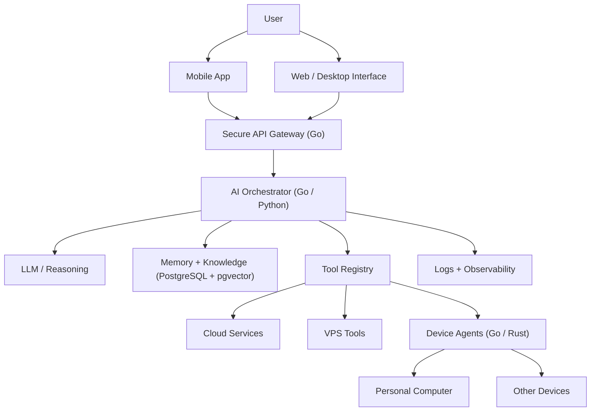

# Kiwi — Personal AI System

> **Vision:** Build a personal AI system (JARVIS-like) that I own and continuously improve — accessible from my phone, connected to my computer and services, capable of remembering context, using tools, executing tasks, and eventually interacting with the physical world.

---

## 1. Architecture Overview

Kiwi is a long-lived personal computing system rather than a single chat application. An always-on VPS acts as the **control plane and brain**, while lightweight agents run on local devices that require direct access to files, processes, or hardware.



### Architectural Layers
- **Layer A — Interfaces**: Mobile app (Android/iOS remote control), Web dashboard, and future desktop/voice interfaces.
- **Layer B — Gateway (Go)**: Authentication, authorization, rate limiting, request validation, session management, and response streaming.
- **Layer C — AI Orchestrator (Go / Python)**: Intent comprehension, planning, tool selection, task state tracking, model calling, error handling, and human approval gating. Starts as a single agent.
- **Layer D — Memory (PostgreSQL + pgvector)**:
  - *Conversation Memory*: Recent interactions and chat context.
  - *Semantic Memory*: Facts, knowledge, and document retrieval.
  - *Episodic Memory*: Important past actions and milestones.
  - *Task State*: Active background jobs and pending approvals.
  - *Preferences*: Stable user preferences and configurations.
- **Layer E — Tool Registry**: Controlled tools adhering to `Schema → Permission → Execute → Validate → Audit → Result`.
- **Layer F — Device Agents (Go / Rust)**: Lightweight outbound-connected agents running on personal devices for filesystem, shell, git, and process management.

---

## 2. Monorepo Structure

Planned layout as a modular monolith:

```text
kiwi/
├── apps/
│   ├── mobile/            # Flutter / React Native / Native client
│   └── web/               # Web dashboard
├── services/
│   ├── gateway/           # Go API Gateway & authentication
│   ├── orchestrator/      # Task execution & LLM reasoning engine
│   ├── memory/            # Storage & pgvector semantic search
│   └── notifications/     # Proactive alerts & push delivery
├── agents/
│   └── device-agent/      # Lightweight daemon running on local machines
├── packages/
│   ├── protocol/          # Shared communication types & schemas
│   ├── tool-sdk/          # Standardized tool definition SDK
│   └── schemas/           # Common data definitions
├── infra/
│   ├── docker/            # Container setups (Postgres, pgvector, etc.)
│   ├── caddy/             # Reverse proxy & automatic TLS
│   └── monitoring/        # Audit logs & health probes
├── docs/                  # Architectural specs & guides
└── scripts/               # Setup, backup, and deployment automation
```

---

## 3. Phased Roadmap

| Phase | Milestone | Focus |
|---|---|---|
| **Phase 0** | **Foundation** | VPS hardening, Docker Compose, PostgreSQL + pgvector, HTTPS, automated backups. |
| **Phase 1** | **Personal API** | Go API server, authentication, user profiles, conversation endpoints, health checks. |
| **Phase 2** | **AI Brain** | Model provider abstraction, context management, streaming responses, structured tool calling. |
| **Phase 3** | **Tool System** | Tool registry, execution safety checks, audit logs, initial core tools (filesystem, shell, git, web). |
| **Phase 4** | **Memory** | Selective persistent memory, semantic vector search, preference management. |
| **Phase 5** | **Mobile App** | Mobile UI, streaming chat, approval notifications, task status dashboard. |
| **Phase 6** | **Computer Agent** | Outbound agent daemon, remote file/git inspection, test execution from phone. |
| **Phase 7** | **Voice Interface** | VAD → STT → Orchestrator → TTS low-latency streaming pipeline. |
| **Phase 8** | **Proactivity** | Deployment monitors, unfinished task reminders, automated alerts. |
| **Phase 9** | **Deep System Integration** | Local file index, developer workflows, calendar/email integrations. |
| **Phase 10** | **Advanced / Experimental** | Rust system runtime, local model inference, vision, hardware nodes. |

### 30-Day Definition of Done
From mobile phone:
> *"Check my project on my computer, inspect the latest git changes, run the tests, and tell me what is wrong."*
The system processes the request via VPS Gateway → AI Orchestrator → Computer Agent → Git/Terminal → AI Analysis → Mobile response.

---

## 4. Core Design Principles
- **Build Incrementally**: Every phase yields a working, usable deliverable.
- **Own the Infrastructure**: Self-hosted, private by design.
- **Least Privilege & Human Approval**: Destructive or irreversible actions require explicit approval.
- **Local-First Sensitive Data**: Outbound device connections avoid exposing local ports to the internet.
- **Everything Observable**: Complete audit trail of tool selections, arguments, and outcomes.

---

## 5. Documentation
- [AGENT.md](file:///root/kiwi/AGENT.md): Operational instructions and guidelines for AI coding agents.
- [DEV_NOTES.md](file:///root/kiwi/DEV_NOTES.md): Living engineering log tracking decisions and updates.
- [ROADMAP.md](file:///root/kiwi/ROADMAP.md): Complete raw roadmap specification imported from Notion.
